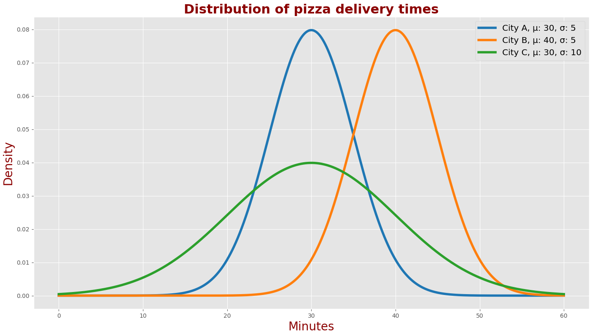
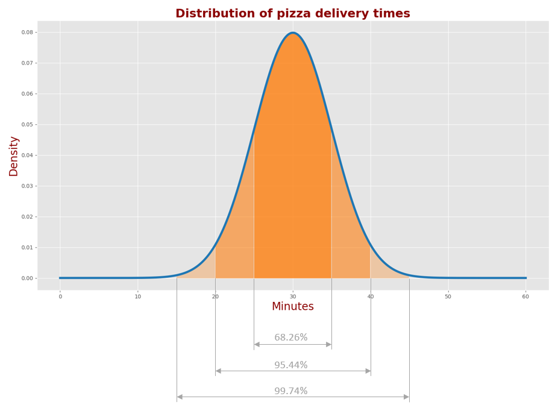

必要的知识背景
======================

本节内容只是很表面的介绍了一下各个概念。

均值和期望
----------------

**均值** 和 **期望** 是密切相关但有所不同的概念。

均值
~~~~~~~~
均值是一组数据中各数据之和除以数据的个数。在概率论中，对于一组数据 :math:`\{x_1, x_2, \ldots, x_n\}`
每个取值的概率分别为 :math:`\{p_1, p_2, \ldots, p_n\}` 均值可表示为:

.. math:: \mu = \sum_{n=1}^{N} x_n \cdot p_n

举个例子，对于一组有四个数的数据集 :math:`\{1, 2, 5, 6\}` 求其均值，每个数据出现的概率相同都为 :math:`\frac{1}{4}` 均值可写成:

.. math:: X =\mu = \sum_{n=1}^{4} x_n \cdot p_n =\frac{1}{4}(1+2+5+6)

由于数据是确定的所以我们可以直接求解出结果。

期望
~~~~~~~

期望是随机变量的加权平均值，反映了随机变量的平均取值。 

什么是随机变量呢，举个例子:老式台称，用它给一块钻石称重量，它自己因为精度和做工的原因，其本身是有误差的。
你称了五次的结果为 :math:`124.7g, 125.3g, 124.9g, 125.1g, 125g` 称重的结果因为误差在随机变化
这就叫随机变量。

所以期望就是对于一个量因为误差我们无法得到准确值，于是对其进行足够多的测量求平均对其准确值进行估计，而这个估计值是我们期望它达到的值。
样本足够多估计值就会逼近真实值。

如果 :math:`X` 是离散型，求其期望：

.. math:: E[X] = \sum_{i=1}^{N} x_i p_i(X=x)

如果 :math:`X` 是一个连续型随机变量，其概率分布函数为 
:math:`f(x)` ,则期望值 :math:`E[X]` 求其期望：

.. math:: E[X] = \int_{-\infty}^{\infty} x f(x) \, dx

均值通常使用希腊字母 μ 来表示。字母 E 通常表示期望。

方差和标准差
----------------
方差和标准差是描述数据集 **分散程度** 的两个重要统计指标。

方差是数据集中的每个数据点与均值之间差异的平方的平均值。对于一组数据 :math:`\{x_1, x_2, \ldots, x_n\}` 求其方差:

.. math:: \sigma^2 = \frac{1}{N} \sum_{i=1}^{N} (x_i - \mu)^2
 
其标准差则为：

.. math:: \sigma = \sqrt{\frac{1}{N} \sum_{i=1}^{N} (x_i - \mu)^2}

还是那一块钻石，其真实值是 :math:`125g` 你测量了5次的结果为 :math:`124.7g, 125.3g, 124.9g, 125.1g, 125g` 现在你能求出
它的方差和标准差吗。

通常我们想要求解一个数据集的方差如果他的元素数目很少我们可以将全部数据纳入到公式求解，
但如果数据集很大还这样求解会耗费很对时间。我们可以取足够的样本，对样本求解以近似表示完整数据集

如果我们想求取全国所有人身高的均值和方差。我们也可以通过收集一个量足够大的样本集。根据这个样本集对全国人民身高的均值和方差进行估计。

但是，从部分样本对真实方差进行估计的方程和从全量样本进行方差计算的方程略有不同。求和后的归一化系数是N−1，而并非 N：

.. math:: \sigma ^{2}= \frac{1}{N-1} \sum _{i=1}^{N} \left( x_{i}-  \mu  \right) ^{2}

.. note:: 

   这个 :math:`\frac{1}{N-1}` 系数称为贝塞尔校正。

正态分布
-------------
自然界许多现象都遵循 正态分布。正态分布又称为 高斯分布，其表达式如下：

.. math:: f \left( x; \mu , \sigma ^{2} \right) = \frac{1}{\sqrt[]{2 \pi  \sigma ^{2}}}e^{\frac{- \left( x- \mu  \right) ^{2}}{2 \sigma ^{2}}}

其函数图像（高斯曲线）又被称为正态分布的 概率密度函数。

下表描述了三个不同城市A、B和C里披萨外卖送达时间的概率密度函数。

这个图描述了三个不同城市A、B和C里外卖送达时间的概率密度函数。

* 在A城，平均送达时间为30分钟，标准差为5分钟。
* 在B城，平均送达时间为40分钟，标准差为5分钟。
* 在C城，平均送达时间为30分钟，标准差为10分钟。

可以看到A城和B城的高斯曲线的形状是一样的，但是其中心对称轴位置不同。这表明在A城点披萨比在B城要平均少等待10分钟，但两座城市里送达时间的散布是差不多的。

还可以看到A城和C城的高斯曲线中心对称轴位置相同，但是形状不同。因此尽管平均送达时间一样，但散布不同。

这个图列出了正态分布的曲线围成面积的比例情况：

* A城里68.26%的送达时间落在 :math:`\mu \pm \sigma` 区间（25-35分钟）
* A城里95.44%的送达时间落在 :math:`\mu \pm 2\sigma` 区间（20-40分钟）
* A城里99.74%的送达时间落在 :math:`\mu \pm 3\sigma` 区间内（15-45分钟）

.. contents:: Table of Contents
   :depth: 3
   :local:
   

