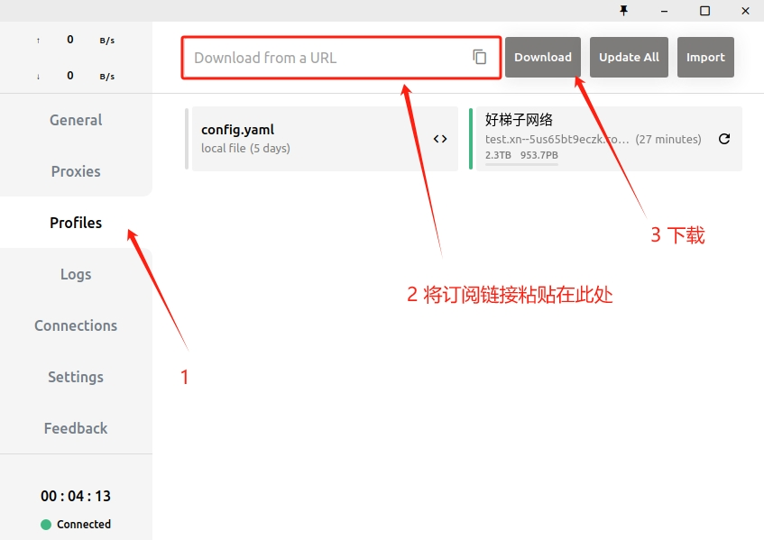
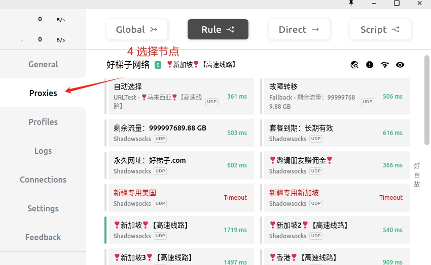
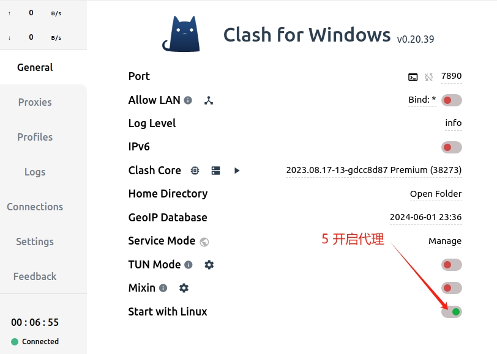
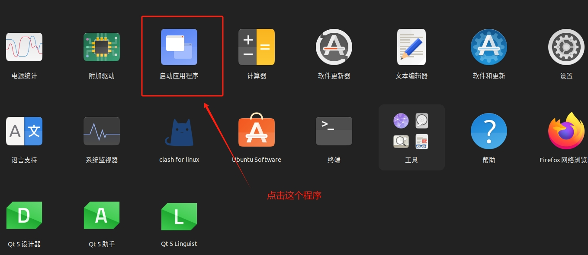
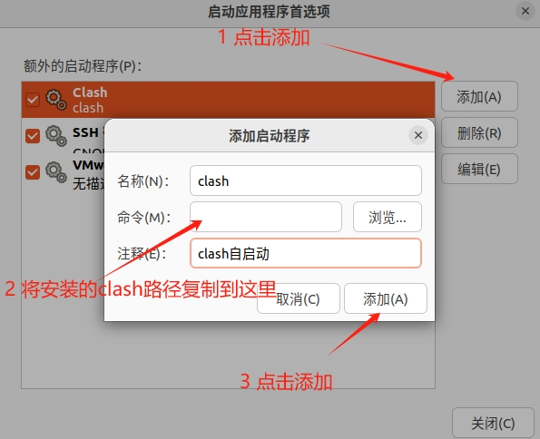

关于vpn
===========

.. note::

   正确使用vpn进行知识学习和科研！！！
   

1.安装
--------

* 下载clash
  
.. code-block:: bash

   cd ~/Downloads
   unzip Clash.for.Windows-0.20.39-x64-linux.zip
   # 进入下载目录并解压

   mv Clash.for.Windows-0.20.39-x64-linux ~/CLASH  #/CLASH该文件为自建的
   # 移动到自定义文件夹

   cd ~/CLASH/Clash.for.Windows-0.20.39-x64-linux
   ./cfw
   # 运行程序

2.导入节点
------------

`购买节点 <https://qiansui888.xjqxz.top/>`__ 需要付费购买

3.设置网络代理
-----------------

.. image:: images/21.png 
   :width: 600 px

* 终端使用代理

.. code-block:: bash

   echo '# Clash' >> ~/.bashrc
   echo 'export http_proxy=http://127.0.0.1:7890' >> ~/.bashrc
   echo 'export https_proxy=http://127.0.0.1:7890' >> ~/.bashrc
   # 写入.bashrc 

4.创建快捷方式
--------------

.. code-block:: bash

   cd ~/.local/share/applications
   touch clash.desktop
   # 进入程序目录创建程序

   sudo gedit clash.desktop
   # 编辑clash.desktop文件

* 将以下内容粘贴到 **clash.desktop** 文件内， **/home/xxx 为你的用户名!!**

.. code-block:: bash

   [Desktop Entry]
   Name=clash for linux
   Icon=/home/xxx/CLASH/Clash.for.Windows-0.20.39-x64-linux/resources/clash.png
   Exec=/home/xxx/CLASH/Clash.for.Windows-0.20.39-x64-linux/cfw
   Type=Application

* 添加权限

.. code-block:: bash

   chmod a+x clash.desktop

5.配置自启动
-------------

.. code-block:: bash

   /home/shakima/CLASH/Clash.for.Windows-0.20.39-x64-linux/cfw
   # 注意修改路径！！！

.. contents:: Table of Contents
   :depth: 3
   :local:
