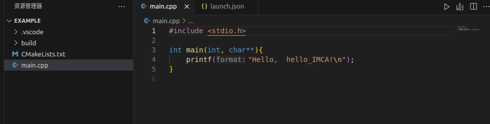

cmake安装和基本使用
=====================

1安装cmake
-------------

1.1.指令安装
~~~~~~~~~~~~~~~~

.. code-block:: bash
   
   sudo apt install cmake  #下载版本可能不是最新的

1.2.源码安装
~~~~~~~~~~~~~

* 第一步：卸载原来的cmake版本:

.. code-block:: bash

   sudo apt-get remove cmake

* 第二步：去 `cmake官网 <https://cmake.org/download/>`__ 下载linux版本源码安装包

* 第三步：在cmake源码所在文件夹中打开命令终端，解压文件

.. code-block:: bash

   tar -zxv -f cmake-x.x.x.tar.gz  #'x.x.x.' 是对应的版本

* 第四步：进入解压后的cmake文件，执行：

.. code-block:: bash

   ./bootstrap

* 第五步：编译构建

.. code-block:: bash

   make

* 第六步：安装

.. code-block:: bash

   sudo make install

* 第七步：验证

.. code-block:: bash

   cmake --version

2cmake的使用
---------------

2.1.为什么使用cmake
~~~~~~~~~~~~~~~~~~~

如果你学习了前面ubuntu的基本学习可以使用指令 ``g++ main.cpp`` 对c/c++文件进行单文件编译，可以将main.cpp中所写的代码编译生成默认文件名为a.out的可执行文件

而在大型工程项目中，程序不可能仅由单一的源文件编写而成。涉及到多文件编译时，通常就会涉及到一个名词“工程”。
简单的，在linux环境下，我们可以使用命令 ``g++ src1.cpp src2.cpp ...`` 来将多个源文件编译成一个可执行文件。

但在实际的工程中，往往并不是仅仅将多个源文件编译到一起就可以，可能还会涉及其他问题。比如：

 * 外部依赖项：需要将第三方软件库的头文件目录添加到编译期的头文件搜索目录中，以找到第三方库的头文件；
   需要将第三方库的链接库（如果有的话）链接到程序中

 * 不同源文件需要不同的编译配置。如，有的源文件可能需要特殊的编译优化等级，而其他的不需要；有的源文件需要链接到外部库，而其他的不需要；
   有的源文件需要添加外部库的头文件目录，而其他的不需要。

为解决上述问题，CMake工具顺应而生。它可以完成的功能包括：多文件编译；管理外部依赖；代码模块化；编译结果安装等。

2.2.初步使用cmake构建工具
~~~~~~~~~~~~~~~~~~~~~~~~~~

学完 **'clang'** 的配置后你已经新建了一个文件夹用来存放你的C++文件，在里面新建一个文件夹命名为example，使用vscode打开，用你学到的方法新建工程

可以看到文件目录下已经新建好了一个 **CMakeLists.txt** 文件

.. code-block:: cmake

   cmake_minimum_required(VERSION 3.0.0)  
   #cmake最小版本
   project(hello_IMCA VERSION 0.1.0 LANGUAGES C CXX)  
   #项目名称“hello_IMCA"

   add_executable(hello_IMCA main.cpp)  
   #生成可执行文件，将“main.cpp"文件生成名为“hello_IMCA“的可执行文件

以上就是CMakeLists文件的最小形式了，这里给出一个链接去 `进一步学习cmake <https://blog.csdn.net/kai_zone/article/details/82656964>`__

2.3.练习
~~~~~~~~~~

访问（克隆） `cmake-examples的github <https://blog.csdn.net/kai_zone/article/details/82656964>`__ 完成里面的例子练习前四个

2024.6.4 Shakima

.. contents:: Table of Contents
   :depth: 2
   :local:
