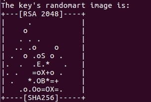
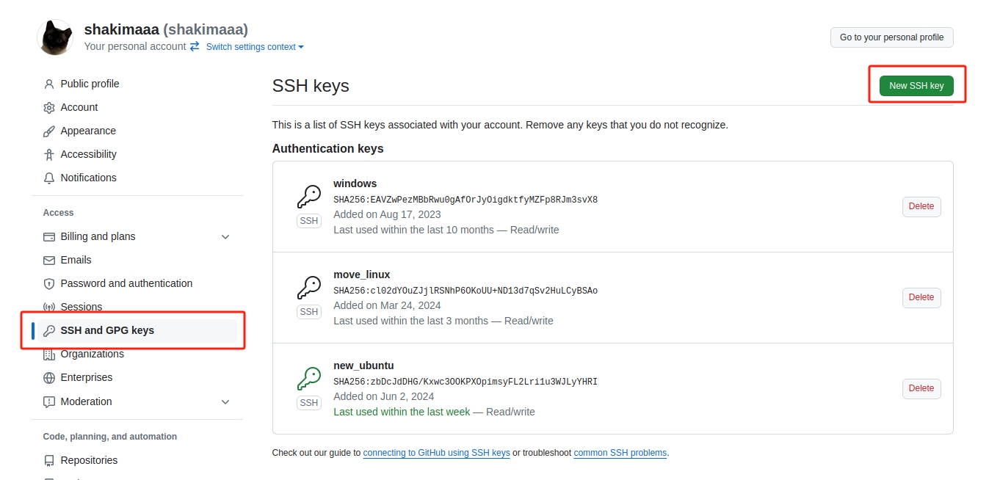

Git和github
==============

1.Git
--------

1.1.关于Git 
~~~~~~~~~~~~~~

Git 是一种分布式开源版本控制系统 (VCS)，我们可以用它存储代码、跟踪修订历史记录、合并代码更改，并在需要时恢复为较早的代码版本。

Git 将我们的源代码及完整的开发历史记录存储在本地存储库中。我们可以创建称作分支的源代码副本，然后与主版本并行作业。完成作业后，我们可以提交更改以保存进度。也可以将分支合并回主版本。

1.2.安装和配置Git
~~~~~~~~~~~~~~~~~~~

* 使用指令安装

.. code-block:: 

    sudo apt-get install git

* 在Git中配置自己的名称和电子邮件地址

.. code-block:: 

    git config --global user.name "xxx" 
    git config --global user.email "xxx@gmail.com"

* 创建验证用的公钥，因为git是通过ssh的方式访问资源库的，所以需要在本地创建验证用的文件

.. code-block:: 

    ssh-keygen -C "xxx@gmail.com" -t rsa

**出现提示设置等直接回车就好**

看到下图说明创建成功

* 使用指令能看到创建的公钥

.. code-block:: bash

    cd ~/.ssh
    gedit id_rsa.pub

2.github
-----------

2.1.关于github
~~~~~~~~~~~~~~~~

GitHub是一个在线软件源代码托管服务平台，使用Git作为版本控制软件。
是一个让大家可以把用 Git 这种版本管理工具管理的内容（项目、代码），能够集中在一起，互相交流、改进的社区。

对于视觉组而言，创建视觉组的github仓库，可以在上面托管视觉代码，每个人都可以访问，方便协作，和版本管理等等。

2.2.注册
~~~~~~~~~~

* 访问 `官网 <https://github.com/>`__ 使用邮箱注册账号
  

* 进入设置，ssh and GPG keys，点击 **New SSH key** 添加公钥
* 将上面生成的公钥复制到里面

.. image:: images/26.png
    :width: 600 px

3.使用Git管理github 
--------------------

* 开一个文件夹，进行Git的初始化

.. code-block:: bash

    git init

* Git的基本指令

.. code-block:: bash
    
    git clone git@xxx.xxx.xxx.xxx:group-name/projectname.git  # 在github创建仓库后，使用其克隆仓库
    git add .     # 添加文件到暂存区
    git commit    # 将暂存区内容添加到仓库中
    git push      # 上传代码到仓库
     
    git status    # 查看仓库当前的状态，显示有变更的文件

更多指令可以访问这里 `Git指令 <https://www.runoob.com/git/git-basic-operations.html>`__

4.作业
~~~~~~~

创建自己的仓库并克隆到本地

2024.6.8 Shakima

.. contents:: Table of Contents
   :depth: 2
   :local: