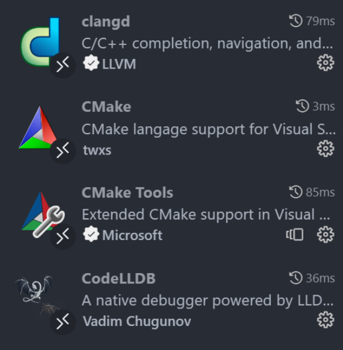
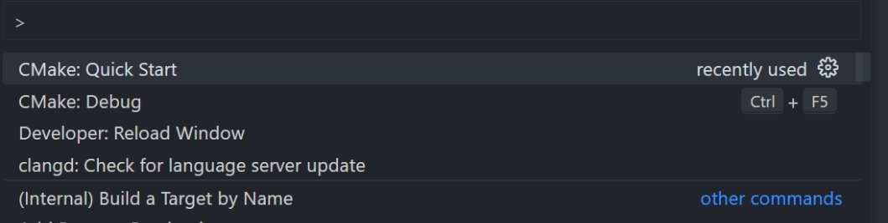
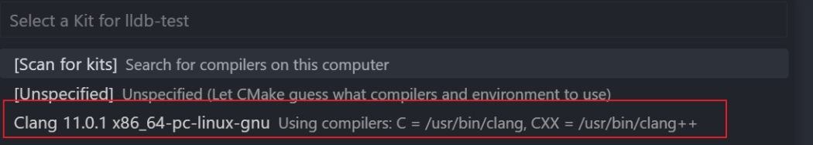
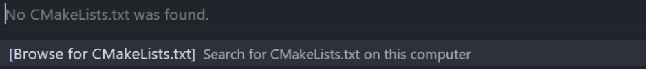
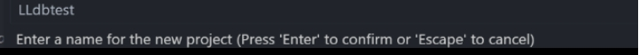
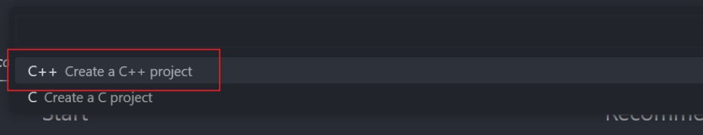
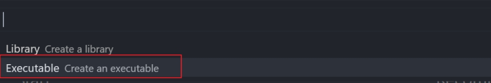
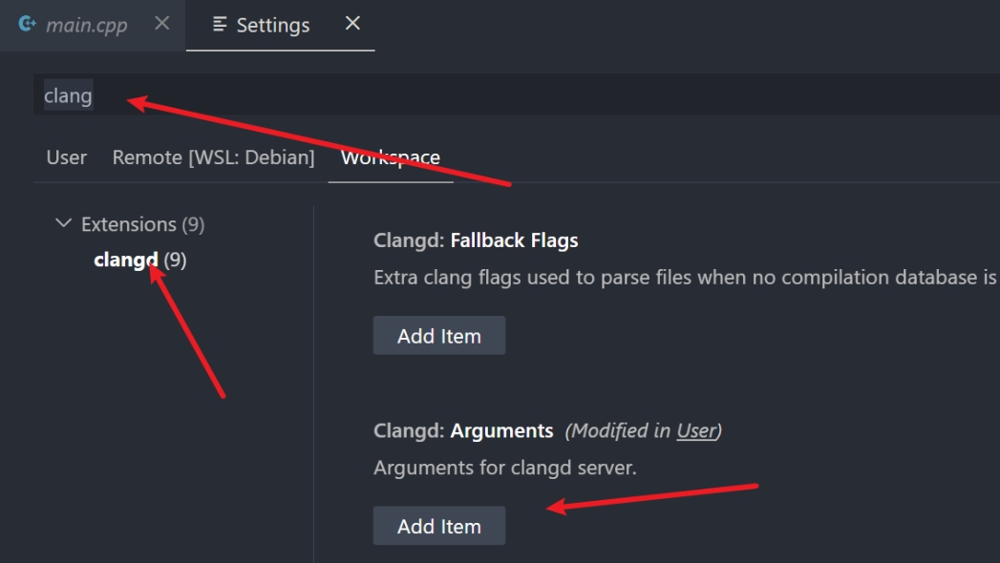
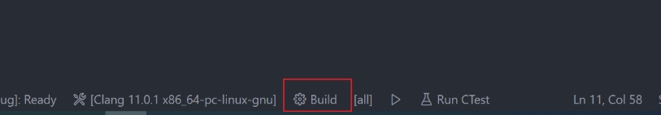
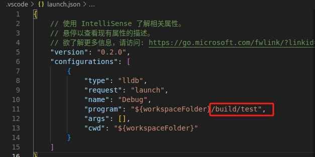

IDE的安装和配置
================

- 我们经常使用的有两种IDE： **vscode** 和 **clion**。这里我们介绍vscode,也推荐使用vscode

1. vscode
-----------

1.1. vscode安装
~~~~~~~~~~~~~~~~

进入 `vscode官网 <https://code.visualstudio.com/>`__ 下载.deb文件

* 打开终端输入以下指令

.. code-block:: bash

    cd ~/Downloads  #进入下载文件夹

    sudo dpkg -i xxx.deb  #xxx为.deb文件的名字

1.2. 配置vscode
~~~~~~~~~~~~~~~~~

推荐使用clangd配置，该教程演示clangd的vscode配置

* 打开终端输入以下指令

.. code-block:: bash

    sudo apt install clang clangd lldb cmake  #安装依赖

* 打开vscode下载下面的扩展
  

* 使用指令新建一个文件夹用来存放代码,并在其内新建一个 **.vscode** 文件

.. code-block:: bash
    
     mkdir CPP_CODE  #创建文件存放cpp代码
     cd CPP_CODE     #移动到文件夹内
     mkdir .vscode   #创建文件放置launch.json文件

* 使用vscode打开CPP_CODE文件夹，使用快捷键 ``CTRL+SHIFT+P`` 然后输入指令 ``Cmake:Quick Start``

* 选择clang编译器

* 不选择cmakelist文件

* 填写项目名称

* 创建c++项目

* 选择可执行程序。cmake会直接帮我们创建一个项目，并创建了main.cpp

* 点击左下角设置图标选择setting（设置），选择workspace,搜索clang，在Arguments一栏，点击Add item，并输入下面参数

.. code-block:: bash

    --compile-commands-dir=${workspaceFolder}/build  

**这时候，.vscode文件夹下面会多出一个setting.json文件，里面是我们刚才写的配置**

* 然后我们点击main.cpp，然后点下面的Build进行编译，会得到一个可执行程序，位于build目录下，然后我们按F5运行，会报出一个错误，找不到launch.json，然后.vscode下面会自动多出一个launch.json

* 修改launch.json，将program参数，修改为我们可执行程序的路径

这时候，再按F5就可以运行了，终端上成功的打出hello frome test

**至此你已完成全部配置**

2024.6.2 Shakima

.. contents:: Table of Contents
   :depth: 3
   :local: